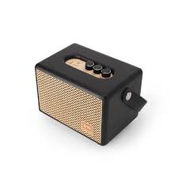

# Product_card
## Date:9/07/25
## Objective:

To replicate a product card layout similar to those found on real-time e-commerce platform like FlipKart using the CSS Box Model (margin, border, padding, and content).

## Tasks:

#### 1. Structure the HTML Layout:
Create a container ```<div>``` for the product card.

Add an `````` for the product image.

Include ```<h2>``` for product name, ```<p>``` for description, and a ```<span>``` or ```<div>``` for price.

Add a “Buy Now” or “Add to Cart” button.

#### 2. Apply Box Model Styling in CSS:
Use padding inside each section (image, text, button) to ensure readability.

Use margin around the card to space it from the page edges or other cards.

Add a border to outline the card.

Control width and height for consistent sizing.

#### 3. Visual Styling:
Add a background color to the card container.

Use box-shadow to simulate depth (card lifting effect).

Add border-radius for rounded corners.

#### 4. Center the Card:
Use display: flex and justify-content: center and align-items: center on the parent container.

#### 5. Bonus Enhancements:
Use a hover effect on the button (e.g., background color change).

Make the card responsive with percentage-based widths or media queries.
## HTML Code:
```html
<!DOCTYPE html>
<html lang="en">
<head>
  
  <title>Flipkart Clone Product Card</title>
  <link rel="stylesheet" href="style.css">
</head>
<body>
    <h1>Featured Products</h1>
  <div class="card-container">
    <div class="product-card">
      
      <h2>Wireless Headphones</h2>
      <p>High-quality sound with noise cancellation. Long-lasting battery life.</p>
      <div class="price">₹2,999</div>
      <button>Add to Cart</button>
    </div>
       <div class="product-card">
      
      <h2>Smartwatch</h2>
      <p>Track your fitness with a stylish and durable smartwatch.</p>
      <div class="price">₹1,999</div>
      <button>Add to Cart</button>
    </div>

 
    <div class="product-card">
      
      <h2>Bluetooth Speaker</h2>
      <p>Portable speaker with high-fidelity sound and waterproof design.</p>
      <div class="price">₹1,499</div>
      <button>Add to Cart</button>
    </div>
  </div>
  
</body>
</html>

```
## CSS Code:
```css

* {
  margin: 0;
  padding: 0;
  box-sizing: border-box;
  font-family: Arial, sans-serif;
}
h1{
    text-align: center;
    color: rgb(255, 0, 0);
}

body, html {
  height: 100%;
  background: #eaedf3;
}

.card-container {
  height: 100vh;
  display: flex;
  justify-content: center;
  align-items: center;
}

.product-card {
  background-color: #fff;
  width: 280px;
  padding: 16px;
  margin: 20px;
  border: 1px solid #ddd;
  border-radius: 12px;
  box-shadow: 0 4px 8px rgba(0,0,0,0.1);
  transition: transform 0.3s ease;
}

.product-card:hover {
  transform: scale(1.02);
}

.product-card img {
  width: 100%;
  border-radius: 8px;
  margin-bottom: 12px;
}

.product-card h2 {
  font-size: 18px;
  margin-bottom: 8px;
  color: #333;
}

.product-card p {
  font-size: 14px;
  color: #555;
  margin-bottom: 12px;
}

.price {
  font-size: 16px;
  font-weight: bold;
  color: #2a9d8f;
  margin-bottom: 16px;
}

button {
  padding: 10px 16px;
  background-color: #2874f0;
  color: white;
  border: none;
  border-radius: 6px;
  cursor: pointer;
  font-weight: bold;
  width: 100%;
  transition: background-color 0.3s ease;
}

button:hover {
  background-color: #155bd5;
}

```
## Output:


## Result:
A product card layout similar to those found on real-time e-commerce platform like FlipKart using the CSS Box Model is replicated successfully.
